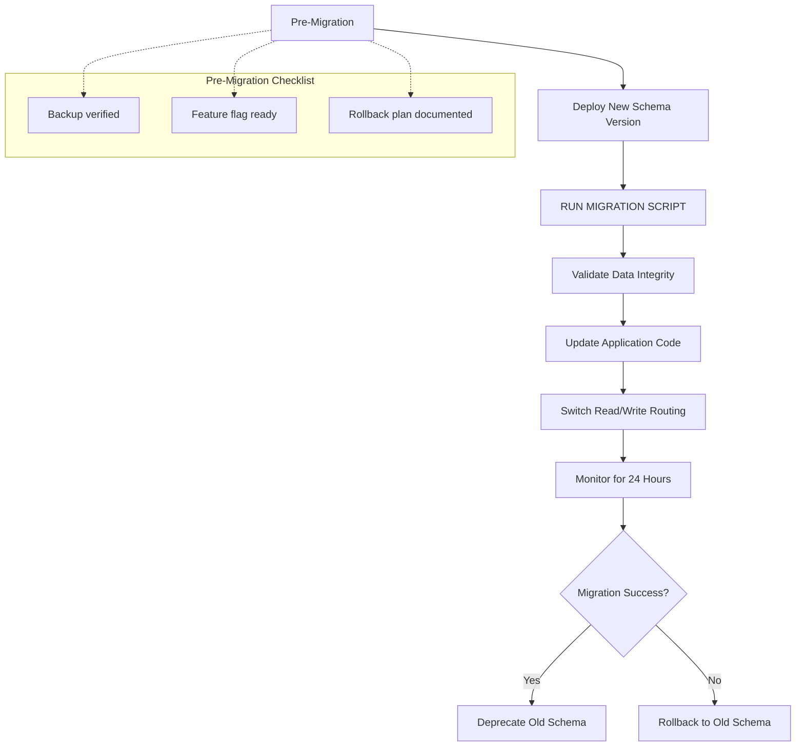

# Database Migration Strategies — Zero-Downtime Patterns

## Purpose
Database migration patterns and strategies for production systems. Maintained by kc-dave, reviewed quarterly.

---

## 1. Migration Types & Risk Levels

| Type | Downtime Required | Risk Level | Rollback Complexity |
|------|------------------|------------|---------------------|
| Schema Evolution (Backward Compatible) | None | Low | Simple revert |
| Data Transformation | Minimal (<5 min) | Medium | Data restore |
| Table Switchover | Planned window | High | Point-in-time restore |

---

## 2. Zero-Downtime Migration Pattern (Mermaid Diagram)



---

## 3. Migration Script Template

```bash
#!/bin/bash
# database-migration.sh — Zero-downtime migration template

set -euo pipefail

MIGRATION_VERSION="2026-04-05-v1"
OLD_TABLE="users_v1"
NEW_TABLE="users_v2"

# 1. Create new table with same schema + additional columns
CREATE_NEW_TABLE=$(cat <<EOF
CREATE TABLE ${NEW_TABLE} (
    id SERIAL PRIMARY KEY,
    username VARCHAR(255) NOT NULL UNIQUE,
    email VARCHAR(255) NOT NULL,
    created_at TIMESTAMP DEFAULT CURRENT_TIMESTAMP,
    migration_verified BOOLEAN DEFAULT FALSE
);
EOF
)

# 2. Copy data with transformation
COPY_DATA=$(cat <<EOF
INSERT INTO ${NEW_TABLE} (id, username, email, created_at, migration_verified)
SELECT id, username, email, created_at, TRUE 
FROM ${OLD_TABLE}
WHERE migration_verified IS NULL;
EOF
)

# 3. Verify data parity
VERIFY_COMMAND="SELECT COUNT(*) FROM ${OLD_TABLE} WHERE NOT EXISTS (SELECT 1 FROM ${NEW_TABLE} WHERE id = old.id)"
```

---

## 4. Rollback Procedure

```bash
# Quick rollback if migration fails
ROLLBACK_STEPS=(
    "1. Revert application code to pre-migration commit"
    "2. Switch read/write routing back to OLD_TABLE"
    "3. Restore from backup if data corruption detected"
    "4. Document incident in post-mortem template"
)

for step in "${ROLLBACK_STEPS[@]}"; do
    echo "Executing: $step"
done
```

---

## 5. Verification Checklist

| Check | Command/Tool | Expected Result |
|-------|--------------|-----------------|
| Data parity | `SELECT COUNT(*) FROM old JOIN new` | Counts match within 1% |
| Query performance | `EXPLAIN ANALYZE <query>` | < 10ms for simple queries |
| Application health | Health check endpoint | 200 OK, all endpoints responsive |

---

## Version History

```markdown
---
Version History:
- 2026-04-05: kc-dave — Initial database migration strategies document
---
```

---

*Created: 2026-04-05 | Owner: kc-dave (orchestrator) | Review cadence: Quarterly*
