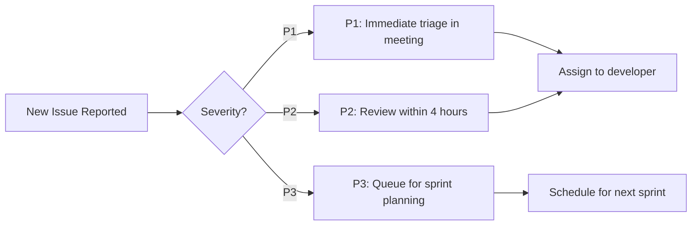

# Defect & Production Issue Management Process

## Purpose

Standardized approach for handling defects, bugs, and production issues across the team.

---

## Classification System

### Severity Levels (Aligned with Incident Response)

| Level  | Name          | Auto-Assign              | SLA      | Example                    |
| ------ | ------------- | ------------------------ | -------- | -------------------------- |
| **P1** | Critical Bug  | kirk → On-call Lead      | 2 hours  | Data loss, complete outage |
| **P2** | High Priority | Automatic (GitHub Issue) | 8 hours  | Major feature broken       |
| **P3** | Medium        | Queue for next sprint    | 48 hours | UI bug, non-blocking       |

---

## Defect Reporting Template

```markdown
# [Concise Title] — [Component/Module Affected]

## Description

[Clear explanation of the defect behavior]

## Steps to Reproduce

1. [First step]
2. [Second step]
3. [Expected vs Actual result]

## Environment Information

- **Browser/OS**: [e.g., Chrome 120 on Windows 11]
- **Build Version**: [e.g., v2.4.1]
- **User Role**: [if applicable]

## Impact Assessment

- **Users Affected**: [Percentage or count]
- **Data Integrity**: [None / Partial / Complete loss]
- **Business Impact**: [Low / Medium / High]

## Logs & Debug Output
```

[Paste relevant logs, error messages, stack traces]

```

## Related Issues/PRs
- Links to related GitHub issues or PRs (if any)
```

---

## Defect Triage Process

### Daily Triage Meeting — kirk Leads



---

## Defect Resolution Workflow

### Phase 1 — Triage & Classification (First Hour)

```bash
# kirk performs initial triage
gh issue list --state=open --label="bug" --limit 20

# Tag with severity if not already tagged
gh issue edit <ISSUE-NUMBER> --label "P1:Critical"
```

### Phase 2 — Investigation & Root Cause Analysis

- Developer reproduces the defect in their environment
- Checks knowledge base for similar past issues (`search_files` on `past-lessons-learned.md`)
- Documents findings in issue comments

### Phase 3 — Fix Implementation

```bash
# Create fix branch with conventional commit prefix
git checkout -b fix/<issue-number>-<short-description>
# Example: git checkout -b fix/1234-user-login-timeout
```

### Phase 4 — Verification & Regression Testing

- Developer tests the fix against reproduction steps
- QA team (bones) performs regression testing
- Document any edge cases discovered

---

## Knowledge Base Enhancement for Defects

### When a defect is resolved, the reporter must:

1. **Update the original issue** with:
    - Root cause explanation (if known)
    - Fix implementation details
    - Lessons learned

2. **Create or update knowledge base entry** if this was a recurring pattern:

```markdown
# [Defect Pattern Summary] — Knowledge Base Entry

## Original Issue(s):

- #1234 — User login timeout under high load
- #1567 — Memory leak in checkout flow

## Root Cause:

[Technical explanation]

## Prevention Measures Added:

- [ ] Code change preventing recurrence
- [ ] Monitoring/alerting improvement
- [ ] Architecture adjustment

## Related KB Documents Updated:

- architecture-principles.md
- github-actions-best-practices.md
```

---

## Verification Commands for Team

```bash
# Find all open bug issues with P1/P2 labels
gh issue list --state=open --label="bug" --label="P1:Critical" --limit 50

# Search knowledge base for related patterns
grep -r "timeout\|memory leak\|race condition" knowledge_base/documents/

# Check recent commits to affected components
git log --since="2 weeks ago" --oneline -- "*auth*" | head -20
```

---

## Ethics & Responsibility

- **No Blame Policy**: Defect reports focus on process improvement, not individual criticism
- **Documentation Duty**: Every resolved defect should contribute to knowledge base growth
- **Transparency**: P1/P2 defects must have status updates at least every 4 hours during active investigation

---

## Version History

```markdown
---
Version History:
    - 2026-04-04: kirk — Initial defect management process creation
---
```

---

_Created: 2026-04-04 | Owner: kirk (Quality Lead) | Review Cadence: Quarterly_
