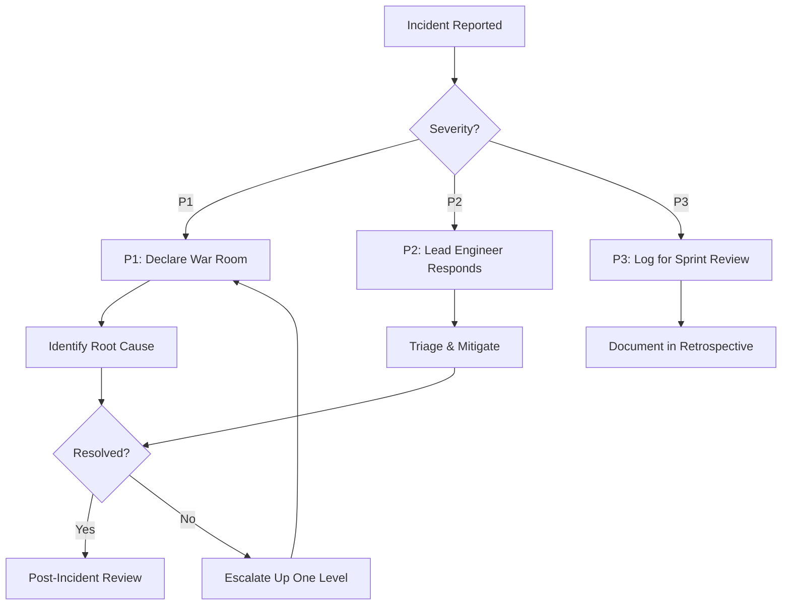

# Incident Response Playbook — IT Team Standard Operating Procedures

## Purpose

Standardized procedures for responding to production incidents. Maintained by kirk, reviewed quarterly.

---

## 1. Severity Classification

| Level | Name                        | Response Time | Affected Users     | Escalation Path            |
| ----- | --------------------------- | ------------- | ------------------ | -------------------------- |
| P1    | Critical — System Down      | 5 minutes     | All users          | On-call → Tech Lead → kirk |
| P2    | High — Major Feature Broken | 30 minutes    | Significant subset | On-call → Team Lead        |
| P3    | Medium — Minor Issue        | 4 hours       | Limited users      | Next sprint review         |

---

## 2. Incident Response Flow (Mermaid Diagram)



---

## 3. Standard Commands & Tools

### Immediate Actions (P1 Only)

```bash
# 1. Check recent deployments
gh run list --limit 5 | xargs -I {} gh run view {} --log

# 2. View recent error logs (if centralized logging available)
# Example: ELK, Datadog, or similar query

# 3. Rollback if needed
git revert <commit-hash> && gh pr create --title "Hotfix rollback"
```

### Escalation Matrix

| Time Elapsed | Action Required                                  |
| ------------ | ------------------------------------------------ |
| 0-5 min      | On-call engineer investigates                    |
| 5-15 min     | Tech lead notified; attempt mitigation           |
| 15-30 min    | kirk notified; consider P1 declaration           |
| 30+ min      | Executive escalation if business impact critical |

---

## 4. Post-Incident Review Template

```markdown
# Incident: <Title>

Date: YYYY-MM-DD
Severity: P1/P2/P3

## Summary

- What happened?
- How long did it last?
- Who was affected?

## Root Cause

[Technical explanation]

## Resolution Steps

[Bullet list of actions taken]

## Lessons Learned

- [ ] What could we do better?
- [ ] Are there preventive measures needed?

## Action Items

| Item | Owner | Due Date |
| ---- | ----- | -------- |
```

---

_Generated by kirk orchestration on 2026-04-04 | Review cadence: Quarterly_
